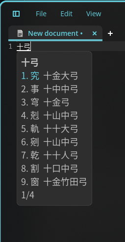
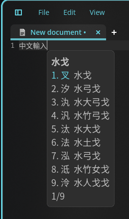
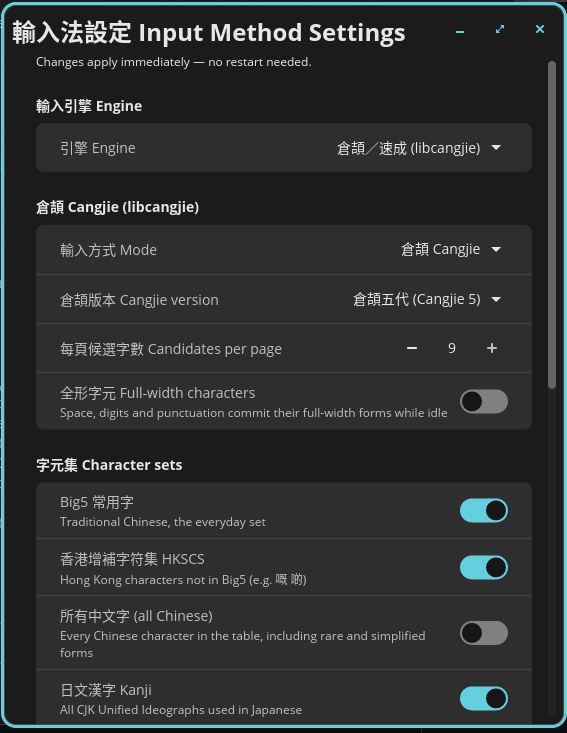

# cosmic-ext-ime — COSMIC 輸入法

[English](README.md) ・ [繁體中文（香港）](README.zh-HK.md) ・ [简体中文](README.zh-CN.md)

為 [COSMIC](https://system76.com/cosmic) 桌面（Pop!_OS）而寫的原生 Wayland 輸入法：
用 [libcangjie2](https://cangjians.github.io/projects/libcangjie/) 輸入**倉頡**與**速成**
（台灣稱簡易），用 [libpinyin](https://github.com/libpinyin/libpinyin) 輸入拼音／雙拼，
也可以透過 librime 使用任何 [RIME](https://rime.im/) 方案（注音、倉頡、行列、拼音等）。

<p>
  
  
  
</p>

## 緣由

`cosmic-comp` 只實作了 `zwp_input_method_v2`。Pop!_OS 24.04 隨附的 IBus 1.5.29
只支援 `zwp_input_method_v1`，Fcitx5 5.1.7 對 v2 的支援也不完整，因此在 COSMIC
上中日韓輸入法預設就無法使用。cosmic-ext-ime 直接與合成器溝通，不需要 IBus
或 Fcitx 常駐程式。

## 安裝

Pop!_OS 24.04 / Ubuntu 24.04（COSMIC）：

```sh
sudo add-apt-repository ppa:wanleungwong/cosmic-ext-ime
sudo apt install cosmic-ext-ime
```

也可以到[發行頁面](https://github.com/wanleung/cosmic-ext-ime/releases)下載 `.deb`，
再執行 `sudo apt install ./cosmic-ext-ime_*.deb`。

從原始碼安裝：

```sh
sudo apt install just       # 或者：cargo install just
just install-user           # 安裝到 ~/.local/bin，含啟動器項目與自動啟動
```

`just install` 是對應的系統層級安裝（/usr/local），`just deb` 在本機打包，
`just ppa` 上傳已簽署的原始碼套件到 PPA。請只採用其中一種安裝方式；
`just uninstall-user` 可移除使用者目錄下的副本。

安裝後請**登出再登入**。之後輸入法會隨每個 COSMIC 工作階段自動啟動，
新的工作階段也會清除舊 IBus／Fcitx 設定殘留的 `GTK_IM_MODULE`（見〈程式支援〉）。

同一時間只應有一個輸入法佔用 seat，因此請先停用 IBus 或 Fcitx5 並移除其自動啟動項目。
重複啟動 cosmic-ext-ime 並無妨：它會偵測到 `$XDG_RUNTIME_DIR` 中的鎖並自行結束。

## 輸入方式

按鍵行為刻意與 [ibus-cangjie](https://github.com/wanleung/ibus-cangjie) 一致。
倉頡版本可在設定中選擇三代（Windows 內建的那一套）或五代：

| 按鍵 | 倉頡 | 速成（簡易） |
| --- | --- | --- |
| `a`–`z` | 輸入字根（最多 5 碼） | 輸入字根（最多 2 碼），滿 2 碼立即查字 |
| `*` | 萬用字元（首碼之後） | 全形 `＊` |
| Space | 查字；只有一個就直接送出；超過一頁則翻頁 | 同上 |
| `1`–`9` | 選字 | 選字 |
| 有候選字時再按字根 | 先送出第一個候選字，再開始新的輸入 | 同上 |
| Backspace／Escape | 刪除上一碼／取消 | 同上 |
| Page Up/Down、↑／↓ | 翻頁（循環） | 同上 |
| 標點、數字、Space（未輸入時） | 取自 libcangjie shortcode 表的全形字元 | 同上 |

拼音（libpinyin）則是整句輸入，由語言模型自動斷詞：

| 按鍵 | 作用 |
| --- | --- |
| `a`–`z` | 輸入拼音；候選字視窗上方顯示斷詞（`ni'hao`） |
| `'` | 強制分隔音節 |
| Space | 送出預測出來的整句 |
| `1`–`9` | 選其中一個詞，繼續輸入其餘部分 |
| Backspace | 先還原上一次選詞，再刪除字母 |
| 標點 | 先送出句子，再輸入全形標點 |

> 注音使用者請改用 RIME 引擎，見下方〈RIME〉一節；libpinyin 引擎目前輸出簡體字。

## 設定

在應用程式清單搜尋「輸入法」「input method」或「倉頡」開啟
**輸入法設定 Input Method Settings**，或執行 `cosmic-ext-ime-settings`。
所有設定立即生效，不需重新啟動：

- 輸入引擎：libcangjie（倉頡／速成）、RIME 或 libpinyin（智慧拼音）
- libcangjie：輸入方式（倉頡／速成）、倉頡三代／五代，以及字元集 —
  Big5、香港增補字符集 HKSCS、全部漢字、日文漢字、平假名、片假名、注音符號、標點、符號
  （假名以 `zj` 加羅馬字輸入，例如 `zja` → あ）
- RIME：選擇任何已部署的方案，修改 `*.custom.yaml` 後重新部署，開啟使用者資料夾
- libpinyin：全拼或雙拼方案、模糊音、簡拼；輸出簡體字
- 每頁候選字數、全形字元、候選字視窗字型大小
- 中英文切換方式（見下文）
- **關於**（標題列的 ⓘ）：版本、授權、致謝與連結

設定透過 cosmic-config 儲存於
`~/.config/cosmic/io.github.wanleung.CosmicExtIme/v1/`，每項設定一個檔案。
任何寫入該位置的工具 — 設定程式、未來 COSMIC 設定中的頁面，
甚至 `echo Quick > .../v1/mode` — 都會被輸入法即時讀取。

### 中英文切換

cosmic-ext-ime 跟隨 COSMIC 本身的輸入來源：在
設定 → Keyboard → Input Sources 加入 **Chinese**，之後 Super+Space
即可切換中文輸入，面板上的輸入來源指示器會顯示目前狀態。
若只設定了一種鍵盤配置，中文輸入會一直啟用。
設定程式中亦可啟用 Ctrl+Space 或輕按 Shift 切換。

### RIME

用 apt 安裝方案，台灣使用者常用的有：

```sh
sudo apt install rime-data-bopomofo rime-data-array30 rime-data-cangjie5 rime-data-terra-pinyin
```

- `bopomofo`、`bopomofo_tw`、`bopomofo_express`：注音（含台灣習慣的配置與快打）
- `array30`：行列 30
- `cangjie5`、`quick5`：倉頡五代、速成
- `terra_pinyin`：地球拼音（輸出正體字）

首次啟動時 cosmic-ext-ime 會寫入
`~/.local/share/cosmic-ext-ime/rime/default.custom.yaml`，列出所有已安裝方案以便全部部署；
可自行精簡清單，或依 RIME 慣例以 `*.custom.yaml` 自訂，
完成後在設定程式按**重新部署 Redeploy**。使用者詞典亦位於同一資料夾（按「開啟」即可）。

### 程式支援

| 工具套件 | 可用？ | 備註 |
| --- | --- | --- |
| COSMIC 程式（iced） | 可以 | 原生 `text-input-v3` |
| GTK 3／GTK 4（gedit、Nautilus、Firefox、GNOME 程式） | 可以 | 原生 `text-input-v3`；`GTK_IM_MODULE` 必須**未設定** |
| Chrome／Electron／VS Code | 可以 | 以 Wayland 模式執行並加上 `--enable-wayland-ime`（例如寫入 `~/.config/code-flags.conf`） |
| Qt 6.5+（Flatpak 版 Qt 程式） | 可以 | 原生 `text-input-v3` |
| Qt 5／Qt 6.4（Pop!_OS 24.04 套件） | 不可以 | 這些 Qt 版本未支援 `text-input-v3`，而 cosmic-comp 僅提供此版本 |
| X11／XWayland 程式 | 不可以 | 需要 XIM 伺服器 |

若先前使用過 IBus 或 Fcitx，請在 `~/.profile`／`/etc/environment` 移除
`GTK_IM_MODULE`、`QT_IM_MODULE` 與 `XMODIFIERS`，再執行 `im-config -n none`，
然後重新登入。這些變數存在時，工具套件會載入舊的 IM 模組，而不與合成器溝通。
cosmic-ext-ime 啟動時偵測到它們會發出警告。

## 疑難排解

- 記錄檔：`journalctl --user -b | grep cosmic-ext-ime`
  （輸入法由工作階段經 systemd 啟動，當機後會自動重啟）。
- COSMIC 程式可以輸入、GTK 程式不行：工作階段中仍設定了 `GTK_IM_MODULE`，
  請參考〈程式支援〉並重新登入。從面板啟動的程式在登出前會沿用舊環境。
- 完全沒有反應：可能有其他輸入法佔用 seat。以 `pgrep -a ibus-daemon fcitx5` 檢查並停用。
- 出現「another cosmic-ext-ime is already running」：工作階段已自動啟動一個，
  直接使用即可，不需再手動啟動。
- RIME 方案清單中找不到某個方案：在
  `~/.local/share/cosmic-ext-ime/rime/default.custom.yaml` 中加入，再按重新部署。

## 專案結構

```
src/                  輸入法本體：Wayland 前端（zwp_input_method_v2 + zwp_virtual_keyboard_v1）
settings/             cosmic-ext-ime-settings，以 libcosmic 撰寫的設定程式
crates/config         設定的資料結構，經 cosmic-config 儲存（本體與介面之間的契約）
crates/engine         InputEngine trait 與共用型別（不含 Wayland、不含 FFI）
crates/cangjie-sys    libcangjie2 的 bindgen FFI
crates/cangjie        安全封裝與倉頡／速成引擎（以真實資料庫測試）
crates/rime-sys       librime C API 的 bindgen FFI
crates/rime           RIME 引擎：每個引擎一個 librime 工作階段，方案來自 rime-data
crates/pinyin-sys     libpinyin 的 bindgen FFI
crates/pinyin         智慧拼音引擎（整句預測、雙拼、模糊音）
```

## 開發

```sh
sudo apt install libcangjie2-dev libsqlite3-dev librime-dev libpinyin15-dev libpinyin-data libglib2.0-dev libxkbcommon-dev libclang-dev libwayland-dev
cargo test --workspace     # 測試會使用真實的 libcangjie2、rime-data 與 libpinyin 資料
RUST_LOG=debug cargo run --release -p cosmic-ext-ime
```

發行：`just release X.Y.Z "摘要"` 會更新 `Cargo.toml`、`debian/changelog`、
AppStream metainfo 與 man page 的版本號，接著提交並建立 tag。
推送 tag（CI 會產生 GitHub release），再執行 `just ppa`。

`libcosmic`（僅設定程式使用）鎖定在 MSRV 仍符合 Launchpad 上 Ubuntu 24.04
最新 Rust 工具鏈的版本；升級前請先以 `cargo +1.91.1 build` 驗證。

## 發展藍圖

- [x] 以 `zwp_input_popup_surface_v2` 顯示候選字視窗（cosmic-text + wl_shm）
- [x] 設定程式（libcosmic），經 cosmic-config 即時生效
- [x] 以 XDG autostart 自動啟動
- [x] 候選字視窗支援 HiDPI／小數縮放，並跟隨 COSMIC 佈景主題
- [x] librime 引擎
- [x] libpinyin 引擎（智慧拼音／雙拼）
- [x] Debian 打包（`just deb`）與 PPA
- [ ] libpinyin 輸出正體字（OpenCC）
- [ ] 整合至 COSMIC 設定 → Keyboard（上游）

## 授權

GPL-3.0-or-later（見 `LICENSE`）。FFI 繫結的 crate 依循其封裝的函式庫：
`crates/cangjie-sys` 為 LGPL-3.0-or-later，`crates/rime-sys` 為 BSD-3-Clause，
`crates/pinyin-sys` 為 GPL-2.0-or-later。
